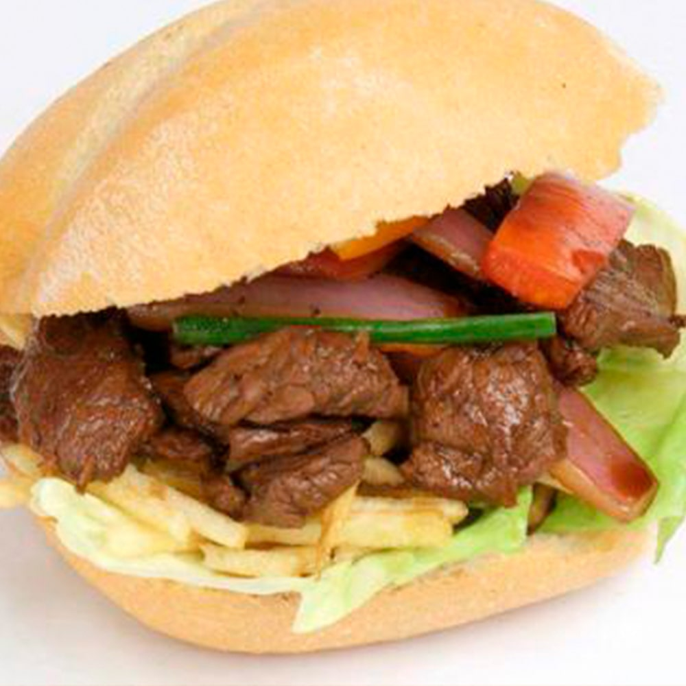
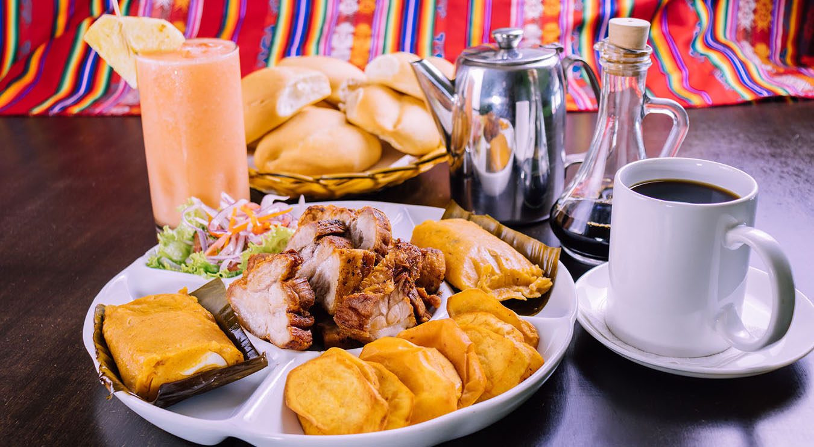
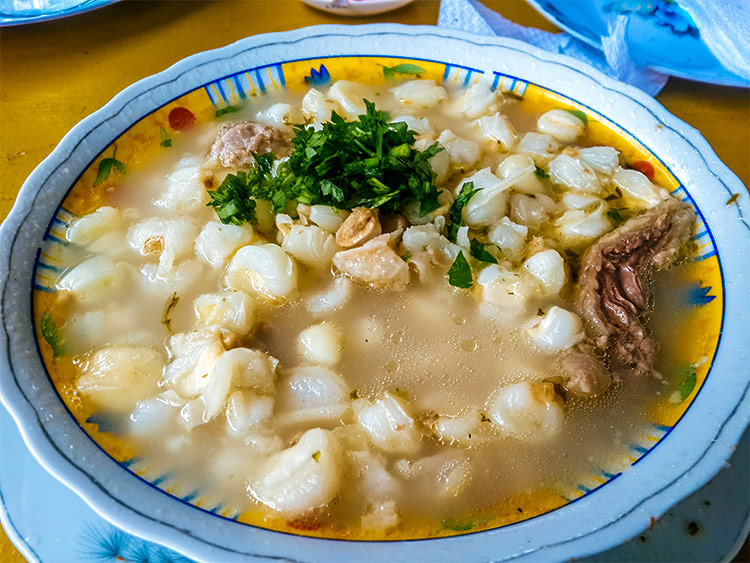

<h1 align= center>BIENVENIDOS</h1> 
Los desayunos bandera del Perú son una muestra de la diversidad culinaria y cultural del país. Cada región cuenta con su propio desayuno emblemático, que representa su historia, ingredientes tradicionales y técnicas culinarias únicas.

Cada uno de estos desayunos bandera tiene un sabor único y refleja la riqueza cultural y gastronómica del Perú. Son una excelente manera de comenzar el día y sumergirse en la variedad de sabores que ofrece este hermoso país.

 
 

<ul>
  <li>Visual Studio Code.</li>
  <li>GitHub</li>
  <li>JavaScript</li>
  <li>Figma</li>
</ul>

# AUTOR :
REBECA  POMA : Scrum Master
